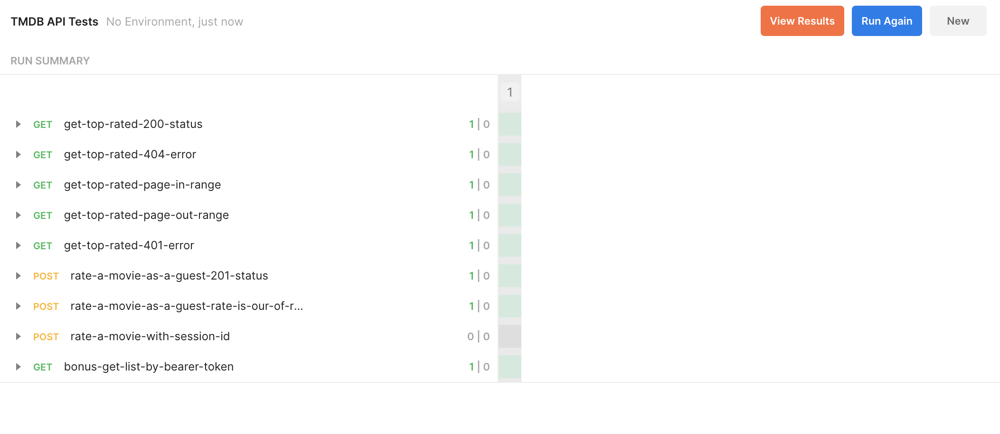
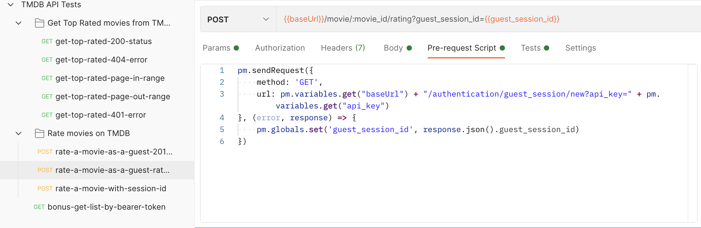

## Postman collection for [TMDb API](https://developers.themoviedb.org/3/) testing

Here you can find the set of requests to the following endpoints:
* https://developers.themoviedb.org/3/movies/get-top-rated-movies
* https://developers.themoviedb.org/3/movies/rate-movie 

### How to launch API tests
Clone this repository: 
```sh
git clone https://github.com/natalliachu/tmdb-api-tests.git
```

The repository contains exported Postman collection with API tests. To launch them you need to have Postman account. If you don't have one you can create it from [Postman Sign Up page](https://identity.getpostman.com/signup).

After succesfull login or signing up you can find a workspace ("My Workspace" by default) with Collections section inside. 

Click "Import" and choose `TMDB API Tests.postman_collection.json` file from the cloned repository.

`TMDB API Tests` collection should be added succesfully. Click on it and you can find "Run" buttion on the right side. 

 


If everything set up correctly you can find big blue "Run TMDB API Tests" button. Click it and enjoy! 😊




### Test structures
In the collection you can find two folders with the requests for "get top rated movies" and "rate a movie". 
There are some variables which are set up for the collection and shared between all the requests. 


The tests can be found in "Tests" tab for each request. 


The tests with `POST` requests to "Rate movies on TMDB" have some Pre-request Scripts which are run before the request is sent and help to get `guest_session_id`.
